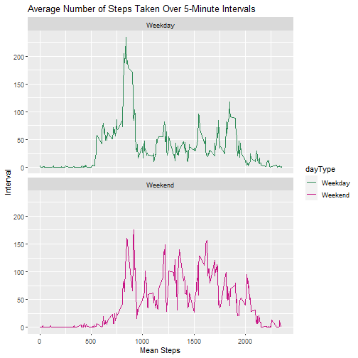

# Reproducible Research Project 1

## Loading and Pre-Processing Data

To start of this data analysis project, we must first load the data and perform some preliminary processing to get acclimated to our dataset. A good practice is to load the dataset in, look at the first few rows, and then calculate some summary statistics. This will lay the groundwork for the rest of our analysis. So, let's cut to the chase and load that dataset in:


```r
if(file.exists("D:\\Documents\\coursera-stuff\\research-project1\\activity.csv")){
  activitydf <- read.csv("D:\\Documents\\coursera-stuff\\research-project1\\activity.csv", header=TRUE)
}
```

Now that we have our CSV loaded into a dataframe let's take a peek at how our data is structured. This can be done by making a call to head to get the first $n$ rows in the dataframe


```r
head(activitydf)
```

```
##   steps       date interval
## 1    NA 2012-10-01        0
## 2    NA 2012-10-01        5
## 3    NA 2012-10-01       10
## 4    NA 2012-10-01       15
## 5    NA 2012-10-01       20
## 6    NA 2012-10-01       25
```

Looks like we have a pretty simple dataset to work with here. There are only 3 columns/variables which can be best summarized from the assignment specification:

1. **steps:** Number of steps taking in a 5-minute interval (missing values are coded as $NA$)
2. **date:** The date on which the measurement was taken in YYYY-MM-DD format
3. **interval:** Identifier for the 5-minute interval in which measurement was taken

It seems like there are a lot of NA's already in the steps column. Let's find out how many NA's are found in the entire dataset along with some other summary statistics.


```r
summary(activitydf)
```

```
##      steps                date          interval     
##  Min.   :  0.00   2012-10-01:  288   Min.   :   0.0  
##  1st Qu.:  0.00   2012-10-02:  288   1st Qu.: 588.8  
##  Median :  0.00   2012-10-03:  288   Median :1177.5  
##  Mean   : 37.38   2012-10-04:  288   Mean   :1177.5  
##  3rd Qu.: 12.00   2012-10-05:  288   3rd Qu.:1766.2  
##  Max.   :806.00   2012-10-06:  288   Max.   :2355.0  
##  NA's   :2304     (Other)   :15840
```

From what we can see by the returned table, there are **2,304** NA's / missing values for the steps columns. Another interesting stat to note is that the average amount of steps taken in an interval is **37.38** while the max amount taken in an interval is a grand **806**!

# 1. What is mean total number of steps taken per day?

To accomplish this, we will need to sum up the number of steps on every given day in the dataset. From there we can plot this in a histogram and then calculate the median and mean for the number of steps taken per day. **Let's go!**


```r
activityByDaydf <- activitydf %>% na.omit() %>% group_by(date) %>% summarise(sumSteps = sum(steps))
activityByDaydf
```

```
## # A tibble: 53 x 2
##    date       sumSteps
##  * <fct>         <int>
##  1 2012-10-02      126
##  2 2012-10-03    11352
##  3 2012-10-04    12116
##  4 2012-10-05    13294
##  5 2012-10-06    15420
##  6 2012-10-07    11015
##  7 2012-10-09    12811
##  8 2012-10-10     9900
##  9 2012-10-11    10304
## 10 2012-10-12    17382
## # ... with 43 more rows
```

Now that we have our steps summed up by day, we can plot this in a histogram:


```r
p <- ggplot(activityByDaydf, aes(x=sumSteps)) + 
  geom_histogram()+ 
  stat_bin(bins=20) +
  labs(title="Steps Taken Per Day", x="Steps", y="Count")

p
```

```
## `stat_bin()` using `bins = 30`. Pick better value with `binwidth`.
```


Now let's calculate the mean and the median for the amount of steps taken per day.


```r
mean(activityByDaydf$sumSteps)
```

```
## [1] 10766.19
```

```r
median(activityByDaydf$sumSteps)
```

```
## [1] 10765
```


So the mean is **10766.19** steps and the median is **10765** steps.


# 2. What is the Daily Activity Pattern?

To get the data for the graph, we must average the steps column by the interval column over every day in the dataset:


```r
activityTS <- activitydf %>% na.omit() %>% group_by(interval) %>% summarise(meanSteps = mean(steps))
activityTS
```

```
## # A tibble: 288 x 2
##    interval meanSteps
##  *    <int>     <dbl>
##  1        0    1.72  
##  2        5    0.340 
##  3       10    0.132 
##  4       15    0.151 
##  5       20    0.0755
##  6       25    2.09  
##  7       30    0.528 
##  8       35    0.868 
##  9       40    0     
## 10       45    1.47  
## # ... with 278 more rows
```

Now let's graph this into a time series plot:


```r
p <- ggplot(activityTS, aes(x=interval, y=meanSteps)) + 
  geom_line(color="red") +
  labs(title="Mean Number of Steps Taken Per 5 Minute Interval", x="Interval", y="Mean Steps")
p
```


From this graph we can see that there is the most activity between intervals 500 and 1000 before tapering off all the way to the last interval. From interval 0-500 there is practically no activity, so I would assume this would correlate to the early morning hours.

Let's try and get the interval that produces the most amount of acivity averaged across all days:


```r
max_steps <- max(activityTS$meanSteps)
activityTS[activityTS$meanSteps == max_steps,]
```

```
## # A tibble: 1 x 2
##   interval meanSteps
##      <int>     <dbl>
## 1      835      206.
```

So interval/minute **835** is the most active on average with **206** mean steps!

# 3. Imputing Missing Values

We know from our loading / pre-proccessing data steps that there are **2304** NA's found in the dataset. We can impute these missing values by taking the mean for a specific interval and placing that in the respective NA position. Lets do this now:


```r
imputedDf <- activitydf

#Get index of missing values
missing <- is.na(imputedDf$steps)

#Calculate means for each interval
means <- tapply(imputedDf$steps, imputedDf$interval, mean, na.rm=TRUE, simplify=T)

#Impute values for NA's
imputedDf$steps[missing] <- means[as.character(imputedDf$interval[missing])]
head(imputedDf)
```

```
##       steps       date interval
## 1 1.7169811 2012-10-01        0
## 2 0.3396226 2012-10-01        5
## 3 0.1320755 2012-10-01       10
## 4 0.1509434 2012-10-01       15
## 5 0.0754717 2012-10-01       20
## 6 2.0943396 2012-10-01       25
```
 
Now that we have our imputed dataset, we can recreate our histogram from earlier and calculate the new mean and median


```r
imputedByDaydf <- imputedDf %>% na.omit() %>% group_by(date) %>% summarise(sumSteps = sum(steps))

p1 <- ggplot(imputedByDaydf, aes(x=sumSteps)) + 
  geom_histogram()+ 
  stat_bin(bins=20) +
  labs(title="Steps Taken Per Day After NA's Imputed", x="Steps", y="Count")

p1
```

```
## `stat_bin()` using `bins = 30`. Pick better value with `binwidth`.
```


We can see that the counts are a bit higher based off of the y axis yet the graph still looks similar to the one we made before. Let's calculate the mean and the median.


```r
mean(imputedByDaydf$sumSteps)
```

```
## [1] 10766.19
```

```r
median(imputedByDaydf$sumSteps)
```

```
## [1] 10766.19
```

So from this we can gather that the mean did not change and the median received a slight boost. Since we use mean values to fill in the NA's our mean will move towards the actual mean for the average number of steps taken per day.

# 4. Are there differences in activity patterns between weekdays and weekends?

Here we will first have to prepare a new dataframe before continuing. We will also have to cast the dates as a "Date" datatype so that we can use it later to decide if it's a weekday or not.


```r
weekdayDf <- activitydf
weekdayDf$date <- as.Date(weekdayDf$date)
str(weekdayDf)
```

```
## 'data.frame':	17568 obs. of  3 variables:
##  $ steps   : int  NA NA NA NA NA NA NA NA NA NA ...
##  $ date    : Date, format: "2012-10-01" "2012-10-01" "2012-10-01" "2012-10-01" ...
##  $ interval: int  0 5 10 15 20 25 30 35 40 45 ...
```

Our conversion was successful, now lets add a new column into our dataset that will correlate with whether or not the given date is a weekday or not.


```r
weekdayDf <- weekdayDf %>% mutate(dayType = ifelse(weekdays(weekdayDf$date) == "Saturday" |
                                                   weekdays(weekdayDf$date) == "Sunday",
                                                   "Weekend", "Weekday"))
weekdayDf$dayType <- as.factor(weekdayDf$dayType)

head(weekdayDf)
```

```
##   steps       date interval dayType
## 1    NA 2012-10-01        0 Weekday
## 2    NA 2012-10-01        5 Weekday
## 3    NA 2012-10-01       10 Weekday
## 4    NA 2012-10-01       15 Weekday
## 5    NA 2012-10-01       20 Weekday
## 6    NA 2012-10-01       25 Weekday
```

Now that we have our new column setup to correlate with the type of day, we can go and create our graph:


```r
weekdaySplit <- weekdayDf %>% na.omit() %>% group_by(dayType, interval) %>% summarise(meanSteps = mean(steps))
```

```
## `summarise()` has grouped output by 'dayType'. You can override using the `.groups` argument.
```

```r
p2 <- ggplot(weekdaySplit, aes(x=interval, y=meanSteps, color=dayType)) +
  geom_line() +
  facet_wrap(weekdaySplit$dayType, nrow=2, ncol=1) +
  labs(title="Average Number of Steps Taken Over 5-Minute Intervals", x="Mean Steps", y="Interval") +
  scale_color_manual(values = c("seagreen", "mediumvioletred"))

p2
```


